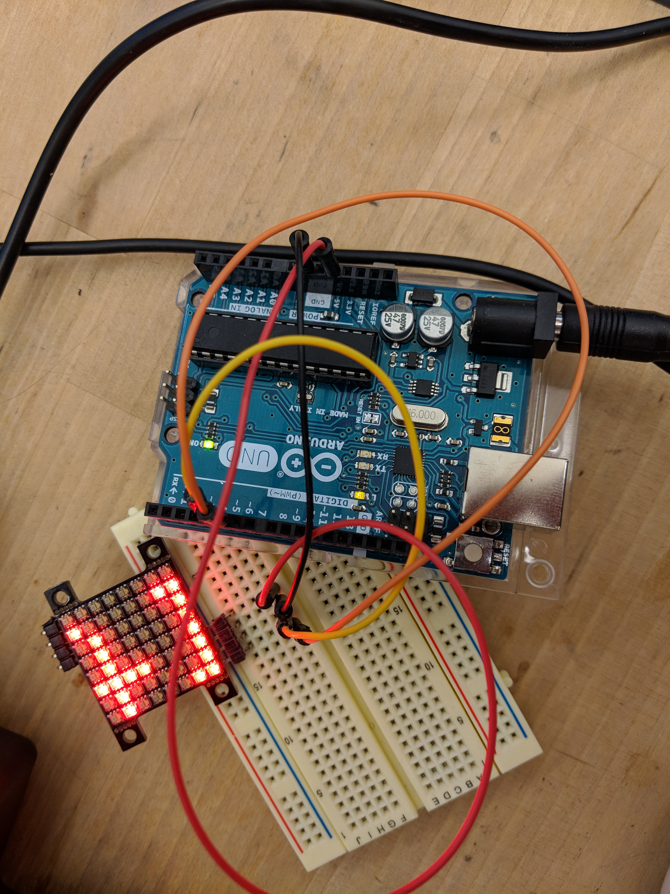

# MatrixBarGraphWorkshop
Included is Code written or edited by Hybrid Lab Workstudy staff for the Matrix and Bar Graph Workshop 2018
Contributors: Ziwei Liu, Dimitri Zampathas, Zoe McCloskey, Lei Xiang

-Code used to make a DIY LED matrix 
Using 8 x 8 leds in a protoboard

-Code to use the Hybrid Lab Number Display
Using a 10 pin number display (2 are ground) in the lab

-Code to use a multiplexing 
Using the 32A908M in the lab and 3 LEDs

-Code to make a BarGraphDisplay 
For our 4 Bar Led Display. When the potentiometer is turned clockwise the lights go up and when it is turned back the lights go down. Our LED bar has 8 pins on each side which means every other pin goes to ground. If there are half as many pins, one side of the LED goes to ground and the other side to all the input pins. 
Other useful links regarding related LED displays avaiable in the HL can be found here: 
Arduino and Matrix Display, Number Display, Bar Graph Display
https://www.youtube.com/watch?v=RWBCsXjZe78
code: http://www.himix.lt/arduino/arduino-and-matrix-number-bar-displays/

-Code for a NeoPixel Matrix (not written in the Hybrid Lab) Must also install the following libraries, the SPI.h is included in this repository for convenience. 
SPI
Adafruit_GFX
Adafruit_DotStarMatrix
Adafruit_DotStar

